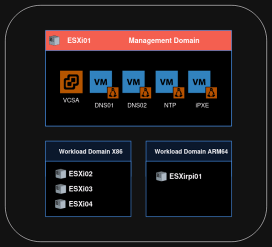

# Introduction
 
 If you want to test several services like a web server, home automation, containers, learn new tech, an home lab or a cloud account could be very useful

 If you go to an home lab, you will need some hypervisors and some storage.

 But when you want to setup your hypervisors, you may need some services like a dns or a ntp, this kind of services you want to host on the same hypervisor you are trying to install. You've got an chicken and eggs problems.

 I use ESXi and vSphere for my home lab, I could use a full IP installation, but I want to play around with dns and certificate, so I wanted a full "production" like installation.

 To solve this problem in my home lab, I follow this plan :

 - install the first hypervisor, no hostname just IP
 - install a first VCSA using an IP setup
 - create a linux Template in this new VCSA
 - create a dns and a ntp server
 - destroy the first VCSA
 - install the final VCSA using ntp and dns server

All this steps can take lot of time. Using terraform, packer and some custom script you can speed up all this!

I love scripting and automation. In this repository you will find all my scripts.

# Disclaimer

All this stuff have not been tested as it is in an production environment, it could be use as a base to make a IaC style production if you add more control, a better design (more vlans, firewall, isolation...)

All password you may found in this repository have to be change and are here only for education purpose.

# my home lab

hardware :
1 x thincentre m700 64G RAM 1To SSD with additional USB nic
3 x thinkcentre m910q 64G RAM 256G nvme 1To SSD with additional USB nic
some manageable switch
1 x rpi4 8Gb with local 1To SSD

the final setup should look like to :

1 ESXi for management workload (VCSA + dns, ntp, optional iPXE)
3 ESXi for x86 workload with vSAN
1 ESXi for ARM64 workload

## diagram


# requirements

- [x] local dhcp server (require for packer template)
- [x] VCSA iso
- [x] ESXi iso
- [x] vault instance
- [x] terraform and packer


# repository organization

```sh
homeLabDeploy/                           
├── 00.vSphere_FillVault           # feel your vault with homelab kv secrets
│   ├── main.tf
│   ├── policies
│   │   ├── admin-policy.hcl
│   │   └── iac-client-policy.hcl
│   ├── Readme.md
│   └── secrets.tf
├── 01.vSphere_Tmp                 # Stage to setup the TMP VCSA
│   ├── main.tf
│   ├── terraform.tfvars
│   └── variables.tf
├── 02.vSphere_Tmp_Customize       # Stage to create the packer template (ubuntu)
│   ├── main.tf
│   ├── terraform.tfvars
│   └── variables.tf
├── 03.vSphere_Tmp_Vms             # Stage to create the VM needs to setup properly a VCSA (DNS and NTP)
│   ├── dnsentries.tftpl
│   ├── main.tf
│   ├── terraform.tfvars
│   └── variables.tf
├── 04.vSphere_Final               # Stage to create the final VCSA
│   ├── main.tf
│   ├── terraform.tfstate
│   ├── terraform.tfvars
│   └── variables.tf
└── Readme.md

```

# let initialize some variable

You will need secrets for your home labs (ESXi, VCSA, root password, api key etc ...) and some information like IP address, hostname, domain name etc ...

I've got a vault from hashicorp running on my laptop. I use the key/value engine to store both secrets and config information, 

If you don't have one just kick one using docker! You will found in homeLabDeploy/00.vSphere_FillVault a quick terraform to fill your vault with a kv-v2 store for minimal lab deployment (more info in Readme.md file in this folder)

go to stage_init folder, edit variable.tf to fill all information need for the lab setup

export your vault endpoint and token and run terraform to fill your vault, also export VAULT_SKIP_VERIFY=true if you don't have the CA root certificate in your certificate manager.

```sh
$ export VAULT_TOKEN=XXX.XXXXXXXXXXXXXXXX
$ export VAULT_ADDR=https://127.0.0.1:8200
$ export VAULT_SKIP_VERIFY=true
$ terraform init
$ terraform apply
```

don't forget to install at least the first ESXi using an usb stick or cdrom

# first stage, create the temporary VCSA

# second stage minimal setup of VCSA and first template


Now our temporary VCSA is up and running, we will customize a bit and use the vSphere API to create the first linux template using packer

I use ubuntu server 22.04 LTS and setup cloud-init

```sh
$ export VAULT_TOKEN=XXX.XXXXXXXXXXXXXXXX
$ export VAULT_ADDR=https://127.0.0.1:8200
$ export VAULT_SKIP_VERIFY=true
$ terraform init
$ terraform apply
```

# third stage, create dns and ntp servers

we got a linux template, let's use it to create the first two services dns and ntp

to install the service, I use cloud-init, like that i don't have to connect to setup everything like you do with ansible.

I use powerdns as a dns server, even if with a terraform provider you could create and manage your zone, for the first setup i use bash script bundle in my cloud init to create the zone. I create two of them just in case you need to update one, all your service depend on dns is still up. both dns server act as primary server, no sync between both of them.

I use ntpsec to sync the ntp server to a public ntp server for security reason. you could choose your ntpsec server [here][ntplist]

```sh
$ export VAULT_TOKEN=XXX.XXXXXXXXXXXXXXXX
$ export VAULT_ADDR=https://127.0.0.1:8200
$ export VAULT_SKIP_VERIFY=true
$ terraform init
$ terraform apply
```

# fourth stage, cleanup temporary VCSA and create the final one

Ok know we have dns and ntp, let cleanup !

connect to your ESXi and poweroff the temporary VCSA and delete it. Currently we cannot do a terraform destroy for the first stage, as the first stage run vcsa-deploy which have no option to destroy what you have created with it.


know you have to run the final stage in folder vSphere_Final

```sh
$ export VAULT_TOKEN=XXX.XXXXXXXXXXXXXXXX
$ export VAULT_ADDR=https://127.0.0.1:8200
$ export VAULT_SKIP_VERIFY=true
$ terraform init
$ terraform apply
```

after this run, you will have a vcenter ready with a local fqdn and ntp.

# what to do next

Now connect to your freshly installed virtual center and import back the template.
You can install all other ESXi host.


[ntplist]: https://netfuture.ch/2021/12/transparent-trustworthy-time-with-ntp-and-nts/#server-list